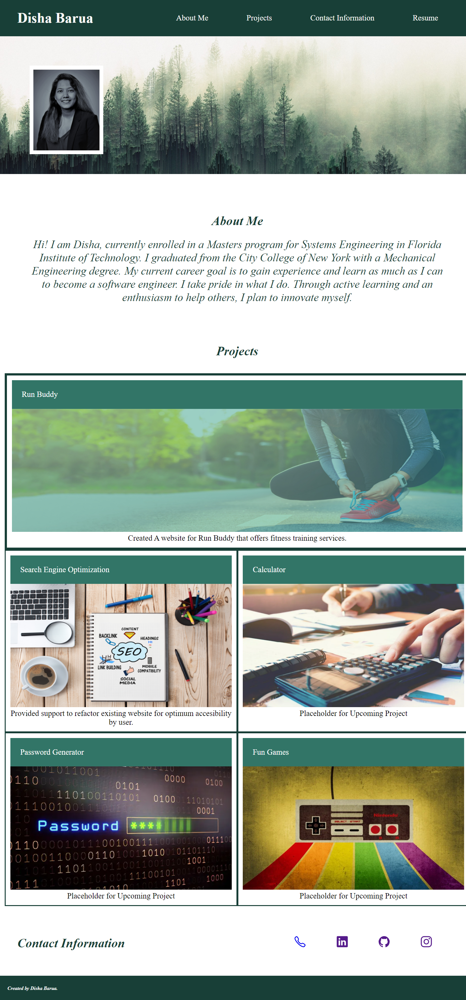

# disha-portfolio
## Weekly Challenge 2: Advanced CSS Challenge: Professional Portfolio

## Author
Disha Barua

## Link
Deployed code: https://disha2022.github.io/disha-portfolio/

Github repository: https://github.com/Disha2022/disha-portfolio

## User Story
AS AN employer
I WANT to view a potential employee's deployed portfolio of work samples
SO THAT I can review samples of their work and assess whether they're a good candidate for an open position


## Project Description
Purpose of this project is to build a portfolio to showcase projects for securing a position as software developer.

## Tools
1. CSS
2. HTML

## index.html
1. Created framework for portfolio and created the portfolio from the scratch.
2. Added header elements and linked them with the appropriate sections.
3. Added background image and scaled it with the profile picture (class="Reso").
4. Created section for "about me". Used percentage as font size since it changes with respect to ratio of screen size and less work needed during editing media queries.
5. Added project section. separate class ("main-item") was applied to 1st image. That is the project is larger than the rest.
6. Added links for the project images.
7. Incomplete projects are used as placeholder, added appropriate comment below each box.
8. Created section for contact information.
9. Added icon and links for linked in, GitHub, Instagram, and phone.
10. Linked "resume" for the resume in the header
11. Added footer
12. Edited CSS code per change made in index. 

## style.css
1. Edited "main-item" class for the large project "Run Buddy"
2. Edited "item" for rest of the projects. 
3. Added padding, margins, and other styles for all the classes. 
4. Added flex to display the screen in different screen sizes. 
5. Added hover element for profile picture and projects
6. Added Media Query selectors


## Demo for Portfolio: Disha Barua



# Reference
## Acceptance Criteria

```
GIVEN I need to sample a potential employee's previous work
WHEN I load their portfolio

THEN I am presented with the developer's name, a recent photo or avatar, and links to sections about them, their work, and how to contact them

WHEN I click one of the links in the navigation
THEN the UI scrolls to the corresponding section

WHEN I click on the link to the section about their work
THEN the UI scrolls to a section with titled images of the developer's applications

WHEN I am presented with the developer's first application
THEN that application's image should be larger in size than the others

WHEN I click on the images of the applications
THEN I am taken to that deployed application

WHEN I resize the page or view the site on various screens and devices
THEN I am presented with a responsive layout that adapts to my viewport
```

The following animation shows the web application's appearance and functionality:

## Review

You are required to submit BOTH of the following for review:

* The URL of the deployed application.

* The URL of the GitHub repository that contains your code. Give the repository a unique name and include a README file that describes the project.

- - -
© 2022 Trilogy Education Services, LLC, a 2U, Inc. brand. Confidential and Proprietary. All Rights Reserved.